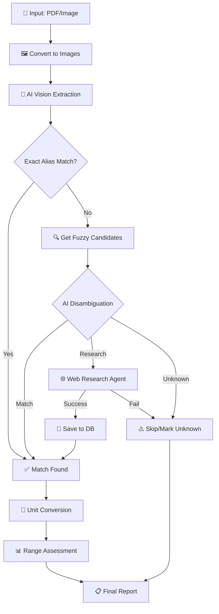

# 🩸 Open Blood Analysis

An AI-powered blood test analysis tool that extracts biomarkers from lab reports (PDF/images), matches them against a knowledge base, and provides normalized results with reference range assessments.

## ✨ Features

- **Multi-format Support** - Analyze PDFs and images (PNG, JPG, etc.)
- **AI-Powered Extraction** - Uses vision models to extract biomarker data from scanned reports
- **Smart Matching** - Exact alias matching + AI disambiguation for fuzzy matches
- **Auto-Research** - Automatically researches unknown biomarkers via web search
- **Unit Conversion** - Converts units to canonical formats using safe expression evaluation
- **Demographic Ranges** - Adjusts reference ranges based on age and sex
- **Granular Status** - Distinguishes `low/high`, `optimal`, `moderate`, and `elevated`
- **Growing Knowledge Base** - Learns new biomarkers and saves them for future analyses

## 🔄 Processing Pipeline



## 📦 Installation

### Prerequisites

- Python 3.13+
- [uv](https://github.com/astral-sh/uv) (recommended) or pip
- Gemini API key
- Poppler (for PDF processing)

### macOS Setup

```bash
# Install poppler for PDF support
brew install poppler

# Clone the repository
git clone https://github.com/yourusername/open-blood-analysis.git
cd open-blood-analysis

# Install with uv (recommended)
uv sync

# Or with pip
pip install -e .
```

### Configuration

Create a `.env` file in the project root:

```bash
GEMINI_API_KEY=your-gemini-api-key
AI_MODEL=gemini-2.0-flash
# Optional task-specific overrides:
# AI_OCR_MODEL=gemini-2.0-flash
# AI_RESEARCH_MODEL=gemini-2.0-flash
# AI_THINKING_MODEL=gemini-2.0-flash
# BIOMARKERS_PATH=biomarkers.json
```

Or export variables directly:
```bash
export GEMINI_API_KEY="your-gemini-api-key"
```

## 🚀 Usage

### Basic Analysis

```bash
# Analyze a PDF report
uv run blood-analysis report.pdf

# Analyze an image
uv run blood-analysis scan.png

# With debug output
uv run blood-analysis report.pdf --debug
```

### With Demographics (for accurate reference ranges)

```bash
uv run blood-analysis report.pdf --sex female --age 35
```

### Output Options

```bash
# Save as JSON
uv run blood-analysis report.pdf --output results.json

# Save as CSV
uv run blood-analysis report.pdf --output results.csv
```

### Disable Auto-Research

```bash
# Only match against existing database
uv run blood-analysis report.pdf --no-research
```

### Manually Re-Research One Biomarker

```bash
# Refresh an existing entry (or add if not found)
uv run blood-analysis --reresearch-biomarker apolipoprotein_b

# Provide explicit unit context for the research prompt
uv run blood-analysis --reresearch-biomarker thyroid_stimulating_hormone --reresearch-unit "uIU/mL"

# Preview researched JSON without writing biomarkers.json
uv run blood-analysis --reresearch-biomarker rdw --dry-run-reresearch
```

## 📊 Example Output

```
                              Analysis Results                              
┏━━━━━━━━━━━━━━━━━━━━━━━━━┳━━━━━━━━┳━━━━━━━━┳━━━━━━━━┳━━━━━━━━━━━━━━━━━━━━━━┓
┃ Biomarker        ┃ Value ┃ Unit  ┃ Reference ┃ Optimal ┃ Peak ┃ Status                   ┃ ID                ┃
┡━━━━━━━━━━━━━━━━━━╇━━━━━━━╇━━━━━━━╇━━━━━━━━━━━╇━━━━━━━━━╇━━━━━━╇━━━━━━━━━━━━━━━━━━━━━━━━━━╇━━━━━━━━━━━━━━━━━━━┩
│ COLESTEROL TOTAL │ 145.0 │ mg/dL │ 0 - 199   │ 130-160 │ -    │ elevated                 │ total_cholesterol │
│ COLESTEROL HDL   │ 40.0  │ mg/dL │ 40 - 80   │ 55-70   │ -    │ moderate                 │ hdl_cholesterol   │
│ LDL              │ 101.0 │ mg/dL │ 0 - 100   │ 55-85   │ -    │ high                     │ ldl_cholesterol   │
└──────────────────┴───────┴───────┴───────────┴─────────┴──────┴──────────────────────────┴───────────────────┘
```

## 🗃️ Biomarkers Database

The tool maintains a `biomarkers.json` file that grows as you analyze more reports. Each entry includes:

```json
{
  "id": "total_cholesterol",
  "aliases": ["COLESTEROL TOTAL", "cholesterol, total", "TC"],
  "canonical_unit": "g/L",
  "description": "Total cholesterol in blood",
  "value_type": "quantitative",
  "enum_values": null,
  "min_normal": null,
  "max_normal": 5.18,
  "min_optimal": 3.6,
  "max_optimal": 4.8,
  "peak_value": null,
  "molar_mass_g_per_mol": 386.65,
  "conversions": {},
  "reference_rules": [
    {"condition": "age > 60", "max_normal": 6.2, "priority": 1}
  ],
  "source": "research-agent-gemini"
}
```

### Unit Conversions

The conversion engine handles generic concentration scaling automatically:
- Mass scaling: `mg/dL <-> g/L`, `ng/mL <-> ug/L`, etc.
- Molar scaling: `mmol/L <-> umol/L`, etc.
- Mass↔molar conversion when `molar_mass_g_per_mol` is provided.

Biomarker `conversions` are only for special transforms not covered generically.

Special formulas use safe expression evaluation with `simpleeval`:
- `x` represents the input value
- Example: `"mg/dL": "x / 38.67"` converts mg/dL to mmol/L

### Demographic Rules

Reference ranges can be customized by demographics:
- Conditions: `sex == male`, `sex == female`, `age > 50`, `age < 18`
- Higher priority rules override lower ones

## 🏗️ Architecture

```
app/
├── main.py      # CLI entry point
├── config.py    # Configuration management
├── loader.py    # PDF/image ingestion
├── llm.py       # Vision model extraction
├── database.py  # Biomarker DB operations
├── agent.py     # AI disambiguation & research
├── logic.py     # Unit conversion & analysis
└── types.py     # Pydantic models
```

## 🤝 Contributing

Contributions are welcome! Please feel free to submit a Pull Request.

## 📄 License

MIT License - see [LICENSE](LICENSE) for details.
