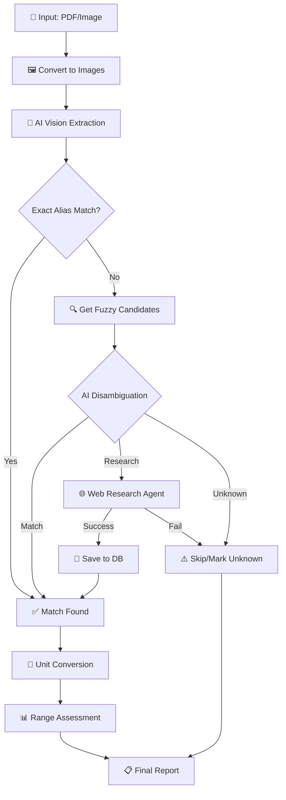

# 🩸 Open Blood Analysis

An AI-powered blood test analysis tool that extracts biomarkers from lab reports (PDF/images), matches them against a knowledge base, and provides normalized results with reference range assessments.

## ✨ Features

- **Multi-format Support** - Analyze PDFs and images (PNG, JPG, etc.)
- **AI-Powered Extraction** - Uses vision models to extract biomarker data from scanned reports
- **Smart Matching** - Exact alias matching + AI disambiguation for fuzzy matches
- **Auto-Research** - Automatically researches unknown biomarkers via web search
- **Unit Conversion** - Converts units to canonical formats using safe expression evaluation
- **Demographic Ranges** - Adjusts reference ranges based on age and sex
- **Growing Knowledge Base** - Learns new biomarkers and saves them for future analyses

## 🔄 Processing Pipeline



## 📦 Installation

### Prerequisites

- Python 3.11+
- [uv](https://github.com/astral-sh/uv) (recommended) or pip
- OpenAI API key (or compatible endpoint)
- Poppler (for PDF processing)

### macOS Setup

```bash
# Install poppler for PDF support
brew install poppler

# Clone the repository
git clone https://github.com/yourusername/open-blood-analysis.git
cd open-blood-analysis

# Install with uv (recommended)
uv sync

# Or with pip
pip install -e .
```

### Configuration

Create a `config.yaml` file in your working directory or use the default:

```yaml
ai:
  api_key: "your-openai-api-key"
  base_url: "https://api.openai.com/v1"  # or compatible endpoint
  ocr: "gpt-4o"           # Vision model for extraction
  research: "gpt-4o-mini" # Model for research agent

biomarkers_path: "biomarkers.json"
```

Or set environment variables:
```bash
export OPENAI_API_KEY="your-key"
```

## 🚀 Usage

### Basic Analysis

```bash
# Analyze a PDF report
uv run blood-analysis report.pdf

# Analyze an image
uv run blood-analysis scan.png

# With debug output
uv run blood-analysis report.pdf --debug
```

### With Demographics (for accurate reference ranges)

```bash
uv run blood-analysis report.pdf --sex female --age 35
```

### Output Options

```bash
# Save as JSON
uv run blood-analysis report.pdf --output results.json

# Save as CSV
uv run blood-analysis report.pdf --output results.csv
```

### Disable Auto-Research

```bash
# Only match against existing database
uv run blood-analysis report.pdf --no-research
```

## 📊 Example Output

```
                              Analysis Results                              
┏━━━━━━━━━━━━━━━━━━━━━━━━━┳━━━━━━━━┳━━━━━━━━┳━━━━━━━━┳━━━━━━━━━━━━━━━━━━━━━━┓
┃ Biomarker               ┃ Value  ┃ Unit   ┃ Status ┃ ID                   ┃
┡━━━━━━━━━━━━━━━━━━━━━━━━━╇━━━━━━━━╇━━━━━━━━╇━━━━━━━━╇━━━━━━━━━━━━━━━━━━━━━━┩
│ COLESTEROL TOTAL        │ 3.75   │ mmol/L │ normal │ total_cholesterol    │
│ TRIGLICERIDOS           │ 0.59   │ mmol/L │ normal │ triglycerides        │
│ HDL                     │ 1.03   │ mmol/L │ normal │ hdl_cholesterol      │
│ LDL                     │ 2.61   │ mmol/L │ high   │ ldl_cholesterol      │
│ GPT (ALT)               │ 24.0   │ U/L    │ normal │ alanine_transaminase │
└─────────────────────────┴────────┴────────┴────────┴──────────────────────┘
```

## 🗃️ Biomarkers Database

The tool maintains a `biomarkers.json` file that grows as you analyze more reports. Each entry includes:

```json
{
  "id": "total_cholesterol",
  "aliases": ["COLESTEROL TOTAL", "cholesterol, total", "TC"],
  "canonical_unit": "mmol/L",
  "description": "Total cholesterol in blood",
  "min_normal": null,
  "max_normal": 5.18,
  "conversions": {
    "mg/dL": "x / 38.67"
  },
  "reference_rules": [
    {"condition": "age > 60", "max_normal": 6.2, "priority": 1}
  ],
  "source": "research-agent-openai"
}
```

### Unit Conversions

Conversions use safe expression evaluation with `simpleeval`:
- `x` represents the input value
- Example: `"mg/dL": "x / 38.67"` converts mg/dL to mmol/L

### Demographic Rules

Reference ranges can be customized by demographics:
- Conditions: `sex == male`, `sex == female`, `age > 50`, `age < 18`
- Higher priority rules override lower ones

## 🏗️ Architecture

```
app/
├── main.py      # CLI entry point
├── config.py    # Configuration management
├── loader.py    # PDF/image ingestion
├── llm.py       # Vision model extraction
├── database.py  # Biomarker DB operations
├── agent.py     # AI disambiguation & research
├── logic.py     # Unit conversion & analysis
└── types.py     # Pydantic models
```

## 🤝 Contributing

Contributions are welcome! Please feel free to submit a Pull Request.

## 📄 License

MIT License - see [LICENSE](LICENSE) for details.
